# How `Created from: <branch>` works in Git Branches Panel

This document explains how the `Git Branches Panel` extension decides when to show:

- `Created from: <branch>`
- `Source status: ...`

The behavior described here matches the implementation in:

- `src/git/branchGit.ts`
- `src/treePresentation/itemPresentation.ts`

## What this feature is

`Created from` is **derived metadata** for **local branches**.

Git does not store a single canonical, always-correct “this branch was created from X” field. The extension has to infer that information from several sources, then choose the best available answer.

That means the label is:

- highly reliable in some cases
- best-effort in others
- intentionally hidden when the only answer is self-referential nonsense such as `Created from: main` on `main`

In the UI, the extension now distinguishes between:

- `Created from: ...` for stronger evidence
- `Inferred base: ...` for weaker or reconstructed ancestry

## Scope

This logic applies to **local branches** loaded by `getBranches()`.

It does **not** try to assign creation ancestry to:

- remote branch rows
- tags
- stashes
- worktrees
- hooks

## What Git actually stores

The most important thing to understand is that Git does **not** store an immutable
"parent branch" field.

Git usually stores some combination of:

- the branch ref itself (`refs/heads/...`)
- upstream tracking config (`branch.<name>.remote` / `branch.<name>.merge`)
- branch reflog entries
- `HEAD` reflog entries
- any extra custom config written by tools

What Git does **not** store is a durable branch ancestry graph like:

- `feature/b came from feature/a`
- `feature/a came from main`

as a permanent first-class object.

That means the extension is always reconstructing ancestry from surviving clues,
not reading a canonical answer.

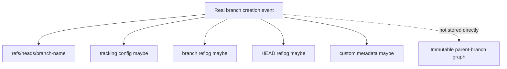

## Why exact branch ancestry is sometimes impossible

The extension can only be as accurate as the evidence that still exists at the
moment it loads the repository.

Exact historical ancestry becomes impossible or unreliable when:

- a local branch was deleted and later recreated
- a branch was recreated from `origin/<same-name>`
- the branch was created via CLI and only weak reflog evidence remains
- the local reflog has expired, been pruned, or never existed in this clone
- the branch was created from detached `HEAD`, a raw commit SHA, or another
    non-branch ref
- multiple local branches point to the same commit tip and only weak compatible
    hints survive

In those cases the extension has to choose between:

- hiding `Created from`
- showing the strongest surviving hint
- collapsing ambiguous same-tip branches to a deterministic root/base

### Reliability matrix

| Situation | Surviving evidence | Can exact parent be proven later? | Typical extension behavior |
| --- | --- | --- | --- |
| Branch created through the extension from a selected branch | Explicit extension metadata | Yes, usually | Show exact source |
| `git checkout -b feature/x` from a local branch, reflog still intact | Branch reflog + `HEAD` reflog | Usually yes | Show exact source |
| `git branch feature/x main`, reflog still intact | Branch reflog | Usually yes | Show exact source |
| Branch created from detached `HEAD` or a raw commit | Reflog may only say `HEAD` or a commit | Often no | Hide source or use another surviving hint |
| Local branch deleted and recreated from `origin/<same-name>` | Tracking config + new reflog saying it came from `origin/<same-name>` | No, not by Git alone | Filter self-reference, then use better fallback if any |
| Fresh clone on another machine | Remote refs + tool-written config, but no original local branch reflog | No | Use compatible hints or hide source |
| Multiple recreated same-tip branches with only weak hints | Weak config hints, same tip SHA | No | Collapse to a unique root/base when one exists |

### Important distinction: deterministic is not always historical proof

Some results are **deterministic** but still not guaranteed to be the true
historical parent branch.

For example, collapsing multiple same-tip recreated branches to `main` is a
stable and user-friendly answer when `main` is the only unique surviving base,
but it does **not** prove that every branch in that group was literally created
directly from `main`.

## High-level resolution order

At a high level, the extension resolves `Created from` in this order:

1. **Explicit extension metadata**
2. **Git reflog hints**
3. **Compatible Git config hints**
   - `github-pr-base-branch`
   - `vscode-merge-base`
4. **Weak same-tip normalization to a unique root/base**
5. **Derived same-tip / containing-branch local anchors**
6. **Self-reference filtering**
7. **Tooltip/source-status rendering rules**

## Overall decision flow

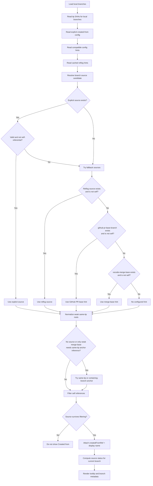

## Data sources and their meaning

### 1. Explicit extension metadata

The extension stores explicit branch ancestry in Git config when a branch is created through extension workflows that know the source ref exactly.

Config key:

- `branch.<name>.gitbranchespanelcreatedfromref`

Examples:

- `refs/heads/main`
- `refs/heads/feature/login`
- `refs/remotes/origin/release/2.4`
- `refs/tags/v2.4.0`

This is the most intentional source because it is written by the extension itself.

### 2. Reflog hints

When branches are created via Git CLI, Git often leaves useful reflog breadcrumbs.

Typical examples:

- `branch: Created from main`
- `branch: Created from feature/login`
- `branch: Created from origin/release/2.4`
- `branch: Created from HEAD`

For `Created from HEAD`, the extension looks at the matching `HEAD` checkout reflog entry to recover the branch that `HEAD` was on.

This is how cases like `git checkout -b feature/x` can still resolve to the branch you were on before creating `feature/x`.

This only works **while that reflog evidence still exists**.

If the reflog is later expired, pruned, or the branch is recreated in a fresh
clone, that exact source may no longer be recoverable.

### 3. Compatible Git config hints

The extension also reads compatible hints written by other tooling.

Supported keys:

- `branch.<name>.github-pr-base-branch`
- `branch.<name>.vscode-merge-base`

These are useful when a repository was not created through this extension, but they are considered **weaker** than explicit metadata or reflog creation records.

They are weaker because they are not guaranteed to mean "this branch was created
from that branch." In practice they are often closer to:

- a PR base branch
- a compare base
- a merge base chosen by another tool
- a stale hint from an earlier branch state

### 4. Same-tip normalization to a unique root/base

When multiple local branches all point to the same commit tip, weak hints can become order-dependent or misleading after branch recreation.

To reduce that drift, the extension normalizes weak same-tip chains to a unique root/base **when one exists**.

Preferred base names are:

- `main`
- `master`
- `develop`
- `trunk`

If none of those exist in the same-tip group, the extension can still use a unique simple branch name (a name without `/`) as the root/base.

### 5. Same-tip and containing-branch anchors

If there is still no good source, or only a weak merge-base hint exists, the extension can derive a better local anchor from:

- a unique same-tip source branch
- or a unique containing-branch source relationship

This helps preserve useful parent-child branch chains when the evidence is stronger than a generic default-branch merge base.

## Source kinds used internally

| Kind | Example | Typical strength | Notes |
| --- | --- | --- | --- |
| `explicit` | `refs/heads/feature/a` | Strongest | Written intentionally by the extension |
| `reflog` | `branch: Created from feature/a` | Strong | Derived from Git creation history |
| `githubPrBase` | `...#main` | Weak | Useful but mutable |
| `mergeBase` | `origin/main` | Weakest | Often generic |
| `sameTipRootBase` | collapse to `refs/heads/main` | Deterministic weak normalization | Used only when a unique root/base exists |
| `sameTipAnchor` | `refs/heads/feature/a` | Derived | Local topology-based fallback |

## Self-reference filtering

The extension intentionally hides self-referential answers.

Two important examples:

- local self:
  - branch `main`
  - source `refs/heads/main`
- recreated local branch from its own remote-tracking ref:
  - branch `test/created-from-feature`
  - source `refs/remotes/origin/test/created-from-feature`

If that is the only answer, `Created from` is not shown.

## Display rules

The tooltip only shows created-from metadata when the final resolved source survives filtering.

The label text depends on the evidence quality:

- **`Created from:`**
    - explicit extension metadata
    - reflog-derived creation history
- **`Inferred base:`**
    - `github-pr-base-branch`
    - `vscode-merge-base`
    - weak same-tip root/base normalization
    - derived same-tip local anchors

The tooltip may also show `Source status`, but only for **current branches**.

For inferred ancestry, the status label also changes to match:

- `Source status: ...` for strong evidence
- `Base status: ...` for inferred ancestry

Possible source-status results:

- `source ref missing`
- `N commit available`
- `N commits available`
- `up to date`

Non-current branches still keep `Created from`, but they do not calculate a live behind-count against the source branch by default.

## Scenario 1: Branch created by the extension from a local branch

This is the cleanest case.

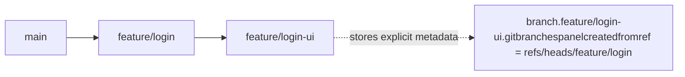

Result:

- `feature/login-ui` shows `Created from: feature/login`

Why:

- explicit extension metadata exists
- it is not self-referential
- no fallback is needed

## Scenario 2: Branch created by Git CLI from the current branch

Example command:

- `git checkout -b bugfix/test`

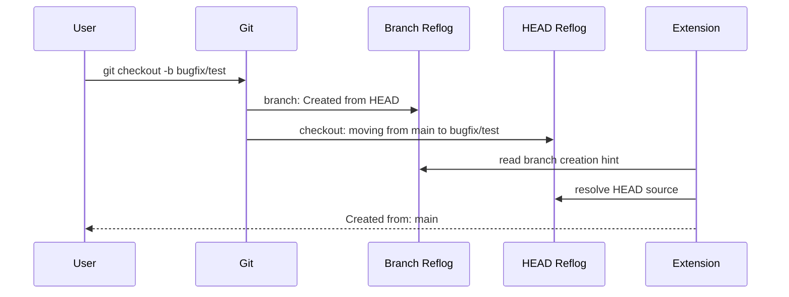

Result:

- `bugfix/test` shows `Created from: main`

Why:

- reflog contains enough information to recover the real source branch
- if the reflog survives, this is usually trustworthy
- if the reflog disappears later, the exact source may no longer be knowable

## Scenario 3: Branch created by Git CLI without checkout

Example command:

- `git branch feature/x main`

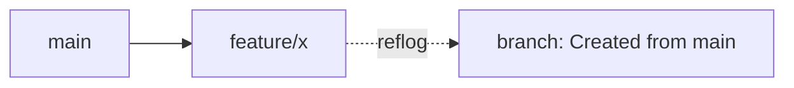

Result:

- `feature/x` shows `Created from: main`

Why:

- reflog already contains the branch name directly
- but only for as long as that reflog entry survives in this repository

## Scenario 4: Repository not created via this extension

Other tools may leave compatible base hints.

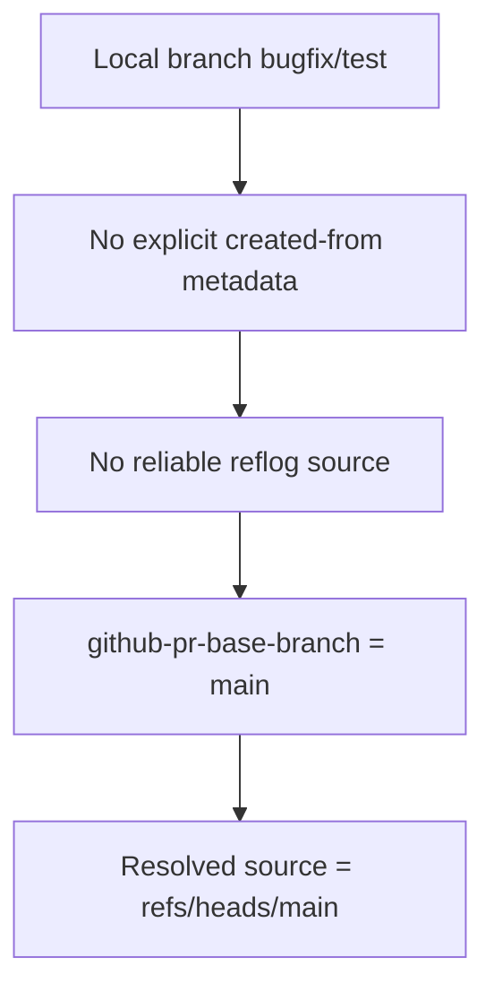

Result:

- `bugfix/test` can still show `Inferred base: main`

Why:

- compatible config exists
- no stronger source overrides it

## Scenario 5: Recreated local branch from its own same-name remote-tracking branch

Example flow:

1. Create local branch from `main`
2. Publish it
3. Delete the local branch
4. Recreate it from `origin/<same-name>`

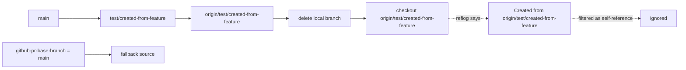

Result:

- recreated `test/created-from-feature` shows `Inferred base: main`

Why:

- `origin/test/created-from-feature` is treated as self-referential for the local branch of the same name
- a better preserved root/base hint survives
- Git itself no longer knows the original local parent branch here; it only knows the branch was recreated from its own remote-tracking ref

## Scenario 6: Recreated same-tip sibling branches with weak peer hints

This is the tricky case that can become order-dependent without normalization.

Suppose all of these point to the same commit tip after recreation:

- `main`
- `test/created-from-feature`
- `test/created-from-feature-2`

And the weak hints look like this:

- `test/created-from-feature` → `test/created-from-feature-2`
- `test/created-from-feature-2` → `main`

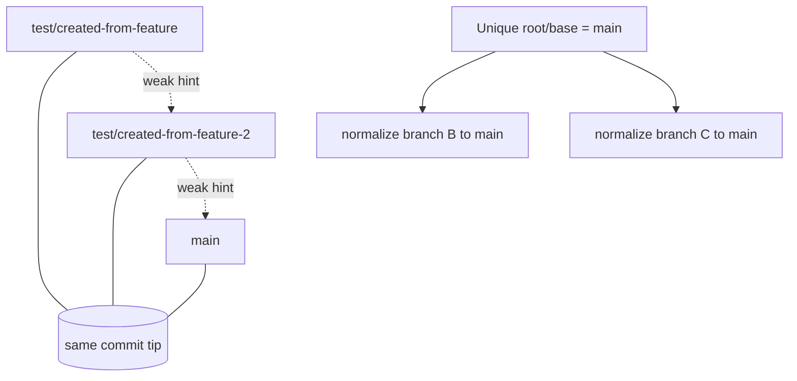

Result:

- `test/created-from-feature` shows `Inferred base: main`
- `test/created-from-feature-2` shows `Inferred base: main`

Why:

- both branches are in the same-tip group
- the surviving hints are weak
- there is a unique preferred base branch (`main`)
- the extension chooses the deterministic root/base instead of a peer-to-peer chain that can swap depending on recreation order

Important nuance:

- this is a **stability policy**, not a guarantee that both branches were
    historically created directly from `main`
- it means `main` is the best unique root/base that still survives in the data

## Scenario 7: Same-tip branches with a stronger direct parent branch

Weak same-tip root/base collapse does **not** replace stronger direct ancestry.

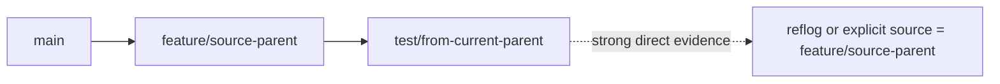

Result:

- `test/from-current-parent` still shows `Created from: feature/source-parent`

Why:

- the branch has a stronger direct source than a weak compatible same-tip hint
- deterministic root/base collapse is only for weak same-tip cases

## Scenario 8: Branch recreated from remote in a fresh clone

This is common when a repository is cloned elsewhere or when the original local
branch history never existed in the current clone.

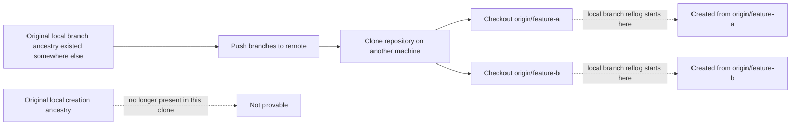

Result:

- the extension can only use what exists in the current clone
- if no stronger metadata survived, the original local parent chain cannot be reconstructed exactly

## Scenario 9: Current branch source status

When the branch is current, the extension also compares the current branch tip against the resolved source ref.

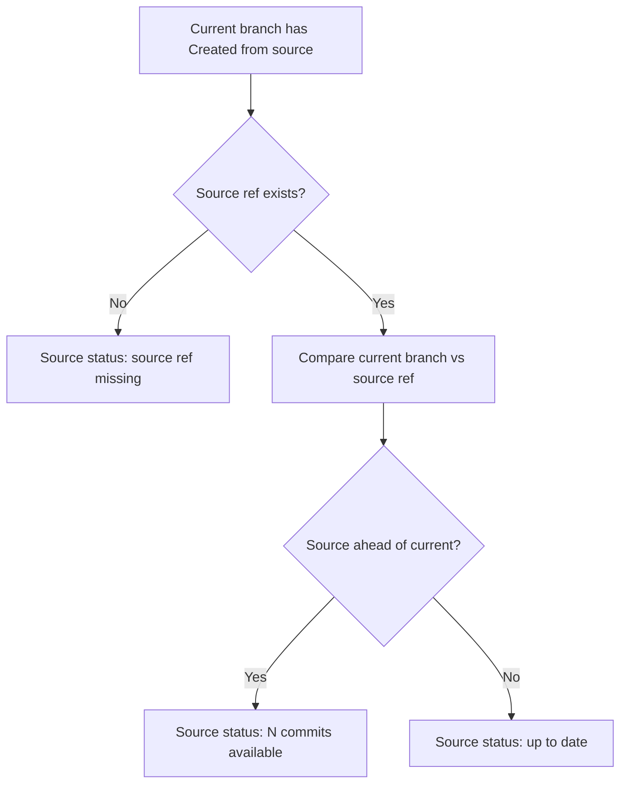

Result examples:

- `Source status: 1 commit available`
- `Source status: 2 commits available`
- `Source status: up to date`
- `Source status: source ref missing`
- `Base status: up to date`

## Scenario 10: CLI branch creation from detached HEAD or a raw commit

When a branch is created from detached `HEAD`, a tag, or a raw commit SHA, Git
may not preserve a meaningful branch name.

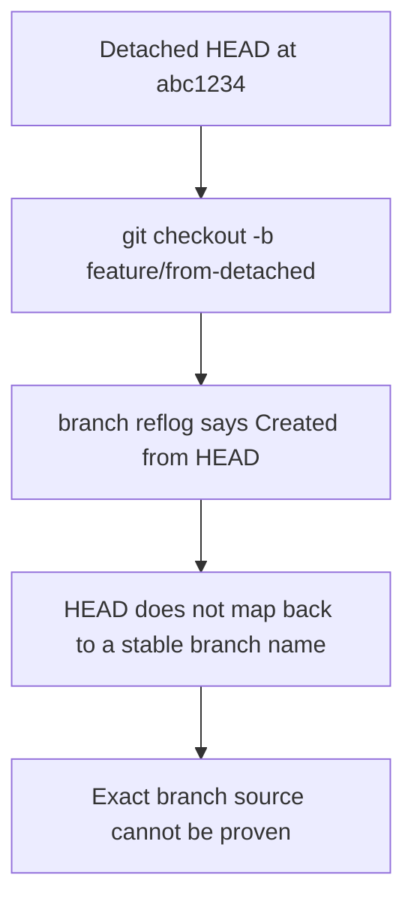

Result:

- if no stronger metadata exists, the extension may hide `Created from`
- if another surviving hint exists, that hint may still be used

## Scenario 11: When nothing reliable survives

If the extension cannot find a source that is both:

- meaningful
- non-self-referential

then it does not show `Created from`.

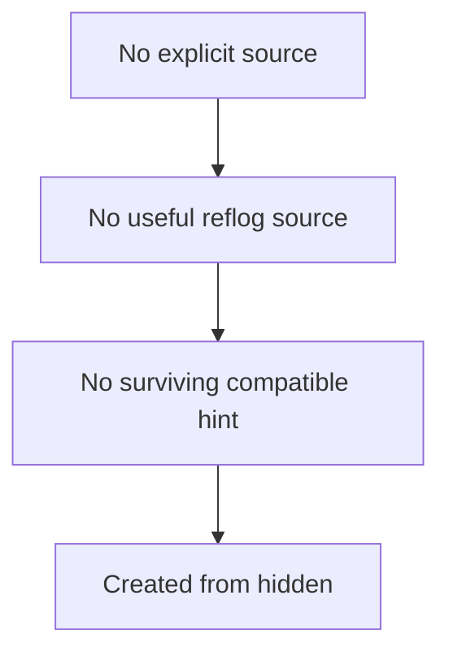

This is preferable to displaying misleading output.

## What is considered deterministic vs heuristic

### Deterministic / stronger

These are the most trustworthy:

- explicit extension metadata
- reflog branch-creation hints
- self-reference filtering
- same-tip weak-hint collapse to a unique root/base

UI mapping:

- strong evidence → `Created from:`
- stable inferred evidence → `Inferred base:`

Deterministic here means:

- stable
- repeatable
- conservative

It does **not** always mean:

- historically proven original parent branch

### Heuristic / best-effort

These can still be useful, but they are not guaranteed to represent the true original creation ancestry:

- `github-pr-base-branch`
- `vscode-merge-base`
- same-tip anchor inference from neighboring local branches
- containing-branch anchor inference

## Important limitations

### Git does not persist perfect ancestry

If a local branch is deleted and later recreated from `origin/<same-branch>`, Git usually only remembers:

- tracking config for that remote branch
- a reflog line like `Created from origin/<same-branch>`

Git does **not** preserve a universal “original parent branch” record.

That is why a branch that was once clearly created from `feature/a` can later
look like it only came from `origin/feature/b`, or can collapse to `main`,
depending on which evidence survived and which hints were rewritten by other
tools.

### Checking out remote branches is especially lossy

When you run something equivalent to:

- `git checkout --track origin/feature/x`

Git is creating a **new local tracking branch** from a remote-tracking ref.

At that point Git naturally records:

- `branch.feature/x.remote = origin`
- `branch.feature/x.merge = refs/heads/feature/x`
- reflog: `Created from origin/feature/x`

That tells us how the **current local branch was recreated**, not necessarily how
the original branch was first conceived.

### CLI workflows can be partially recoverable, not permanently recoverable

CLI creation is often inferable **right after it happens** because reflogs are
still present.

But that does not mean the answer is permanent.

Once reflogs are removed or the branch is reconstructed elsewhere, the extension
is back to using weaker hints.

### Same-tip branch groups can be ambiguous

If several branches all point to the same commit, the extension can only be as accurate as the surviving metadata allows.

The deterministic root/base collapse improves stability when a unique base exists, but it cannot manufacture certainty if all surviving hints are weak and contradictory.

In other words:

- exact parent chain may be gone
- but a unique root/base can still be useful for a stable explanation

### Root/base collapse is intentionally conservative

The root/base normalization only applies to **weak compatible hints**.

It does **not** flatten:

- explicit source metadata
- reflog-derived direct creation hints

That keeps genuinely useful parent-child branch relationships intact.

## Caching and refresh behavior

Reflog-derived hints are cached per repository for performance.

The cache is:

- keyed by local branch names and tip SHAs
- reused briefly
- invalidated when branches are created, renamed, or deleted through extension code paths

This avoids rescanning full reflogs on every refresh while keeping the metadata reasonably fresh.

## Practical summary

If you want the shortest accurate mental model, it is this:

1. Use explicit metadata if the extension wrote it.
2. Otherwise trust Git creation reflogs if they exist.
3. Otherwise use compatible base hints.
4. Ignore self-referential answers.
5. If weak same-tip hints would cause unstable sibling-to-sibling output and there is one clear root/base, collapse to that root/base.
6. Only show live source-status information for the current branch.

If you need an even shorter rule of thumb:

- **strong evidence** → show the exact source
- **weak but stable evidence** → show the unique root/base
- **no meaningful evidence** → hide `Created from`

And in the tooltip that becomes:

- **strong evidence** → `Created from: ...`
- **weak but stable evidence** → `Inferred base: ...`
- **no meaningful evidence** → hide the line entirely

## Related implementation entry points

If you want to trace the code:

- `getBranches()` — main local-branch enrichment pipeline
- `resolveConfiguredCreatedFromRef()` — chooses explicit vs fallback source
- `resolveFallbackCreatedFromRef()` — reflog/config fallback order
- `getCreatedFromReflogHints()` — cached reflog extraction
- `normalizeWeakSameTipSourceRoots()` — deterministic weak-hint root/base collapse
- `resolvePreferredLocalSourceAnchor()` — same-tip / containing-branch anchor inference
- `buildBranchTooltipContent()` — tooltip rendering rules

## Suggested reading order for the code

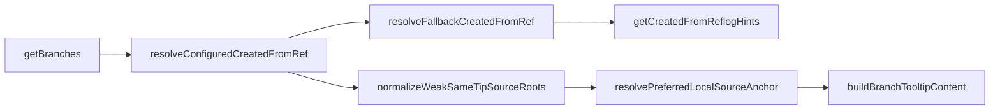
